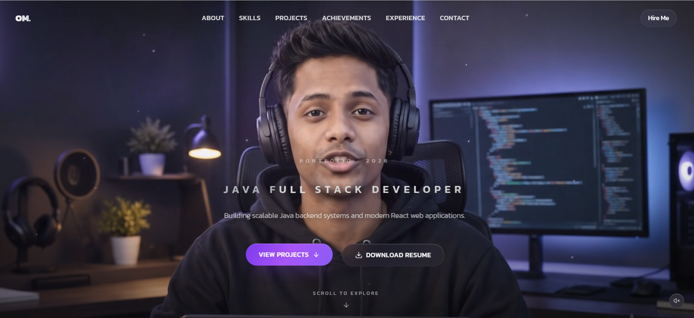
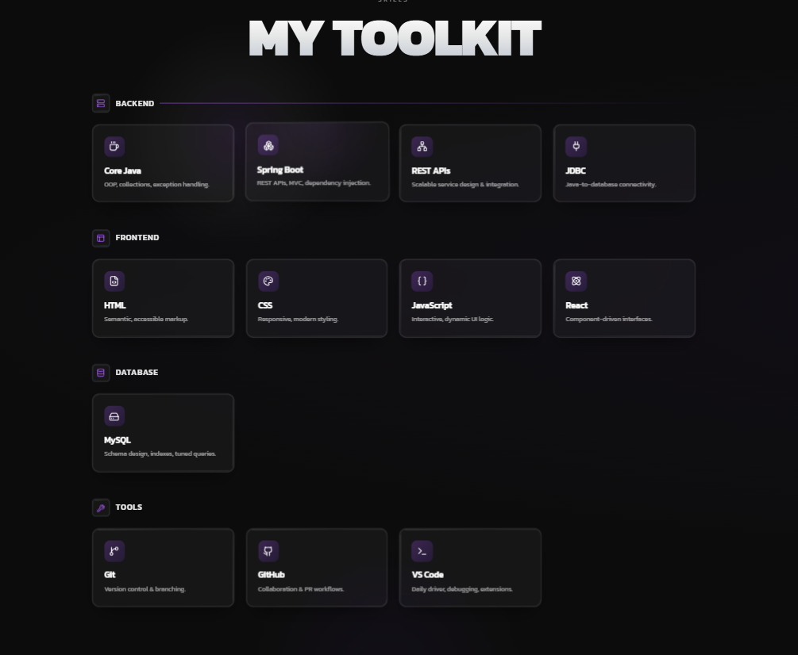
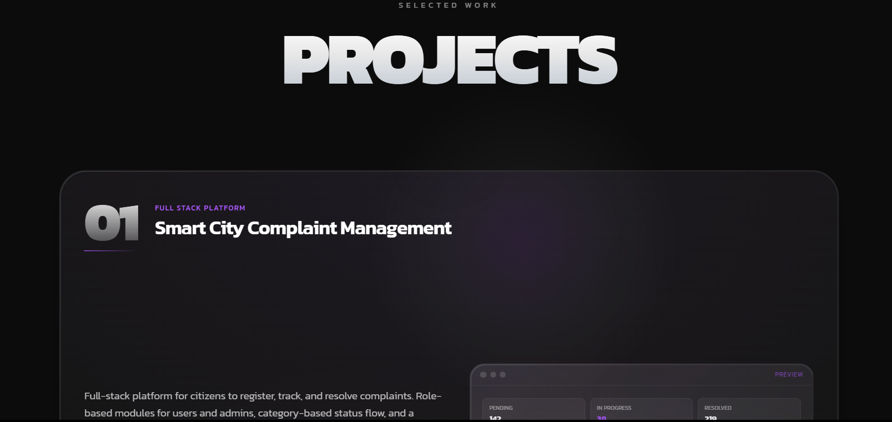
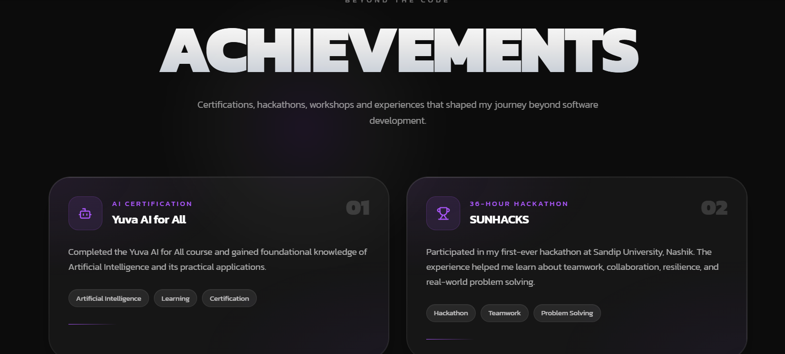
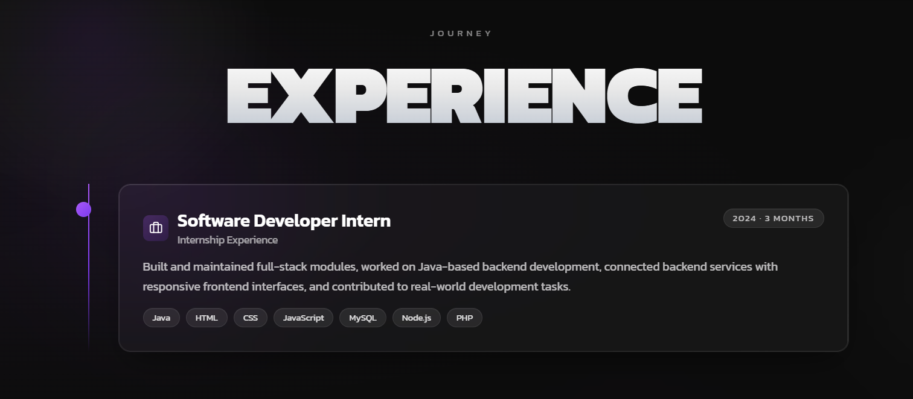

<div align="center">

# OM SHARMA

### JAVA FULL STACK DEVELOPER

Building scalable backend systems and modern web applications.

<br/>

<a href="https://om-portfolio-red.vercel.app/">
  
</a>
&nbsp;
<a href="https://github.com/OMsharma200429">
  
</a>
&nbsp;
<a href="https://www.linkedin.com/in/om-sharma-a0859833a/">
  
</a>

</div>

---

## 👨‍💻 About Me

I'm **Om Sharma**, a Java Full Stack Developer focused on building scalable backend systems and modern web applications.

I enjoy creating clean, responsive interfaces and developing practical applications using Java, Spring Boot, React, SQL and modern web technologies.

---

## 🚀 Portfolio

My portfolio is designed to showcase my:

- 💻 Technical skills
- 🚀 Development projects
- 🏆 Achievements
- 💼 Experience
- 📄 Resume
- 📬 Contact information

### 🌐 Live Website

**https://om-portfolio-red.vercel.app/**

---

## 🛠️ Tech Stack

### 💻 Programming & Backend

`Java` `Spring Boot` `REST APIs` `Node.js`

### 🎨 Frontend

`React` `TypeScript` `JavaScript` `HTML5` `CSS3` `Tailwind CSS`

### 🗄️ Database

`MySQL` `SQL`

### ⚡ Tools & Libraries

`Vite` `TanStack Start` `Framer Motion` `Lucide React` `Git` `GitHub`

---

## ✨ Features

| Feature | Description |
|---|---|
| 🎬 Animated Hero | Interactive hero section with video background |
| 📱 Responsive Design | Optimized for desktop, tablet and mobile |
| 🍔 Mobile Navigation | Responsive hamburger navigation |
| 🎨 Modern UI | Dark, minimal and developer-focused design |
| 🚀 Smooth Animations | Motion-based interactive elements |
| 💼 Projects | Showcase of selected development projects |
| 🛠️ Skills | Technical skills and technologies |
| 🏆 Achievements | Professional achievements and certifications |
| 💻 Experience | Internship and professional experience |
| 📄 Resume | Direct resume access |
| 📬 Contact | Easy way to get in touch |

---

## 📂 Portfolio Sections

```text
Hero
│
├── About
├── Skills
├── Projects
├── Achievements
├── Experience
├── Contact
└── Resume

---

## 🖥️ Portfolio Preview

### 🏠 Hero

<p align="center">
  
</p>

### 🛠️ Skills

<p align="center">
  
</p>

### 🚀 Projects

<p align="center">
  
</p>

### 🏆 Achievements

<p align="center">
  
</p>

### 💼 Experience

<p align="center">
  
</p>
